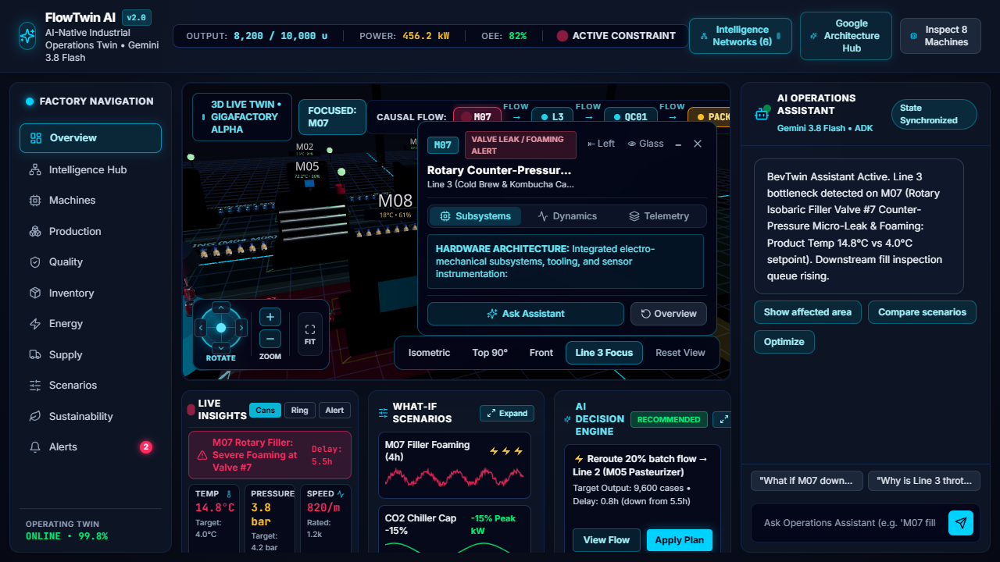

# FlowTwin AI (BevTwin) — AI-Native Beverage Operations Twin

<div align="center">

[](https://nextjs.org/)
[](https://docs.pmnd.rs/react-three-fiber)
[](https://ai.google.dev/)
[](https://cloud.google.com/run)
[](https://python.org)
[](https://www.typescriptlang.org/)
[](https://aibuildercup.com/)
[](https://aibuildercup.com/)
[](LICENSE)

<br/>

**An AI-native 3D Digital Twin for High-Speed Beverage Bottling, Canning & Packaging plants. Autonomous Google ADK agents monitor real-time isobaric filling pressures, carbonation levels, and pasteurization thermal loops — pinpointing causal bottlenecks, simulating what-if scenarios, and executing dynamic load-balancing recovery plans.**

<br/>

[](docs/assets/bevtwin_live_preview.png)

</div>

---

## 📑 Table of Contents

- [🏭 Industrial Beverage Plant Topology](#-industrial-beverage-plant-topology)
- [💡 Core Philosophy: Decoupled AI & Physics](#-core-philosophy-decoupled-ai--physics)
- [🌟 Key Engineering Innovations](#-key-engineering-innovations)
  - [1. 3D Twin & Conveyor Packaging Kinetics](#1-3d-twin--conveyor-packaging-kinetics)
  - [2. Sensory AI & Telemetry Visualizations](#2-sensory-ai--telemetry-visualizations)
  - [3. Holographic Equipment Inspection Modal](#3-holographic-equipment-inspection-modal)
- [🌐 Network Intelligence Studio (6 Interactive Graphs)](#-network-intelligence-studio-6-interactive-graphs)
- [🤖 Google ADK Multi-Agent Architecture](#-google-adk-multi-agent-architecture)
- [📡 Custom Server-Sent Events (SSE) Protocol](#-custom-server-sent-events-sse-protocol)
- [🧮 Mathematical Formulation of Deterministic Simulation](#-mathematical-formulation-of-deterministic-simulation)
- [🧪 What-If Scenario Lab & Sustainability Objective Field](#-what-if-scenario-lab--sustainability-objective-field)
- [☁️ Google Cloud Enterprise Architecture & Tools Hub](#-google-cloud-enterprise-architecture--tools-hub)
- [⚡ Grounded RAG & Industrial Compliance Knowledge Base](#-grounded-rag--industrial-compliance-knowledge-base)
- [📂 Comprehensive Repository Structure](#-comprehensive-repository-structure)
- [🚀 Quickstart & Local Development](#-quickstart--local-development)
- [🐳 Docker & Google Cloud Run Deployment](#-docker--google-cloud-run-deployment)
- [📜 License](#-license)

---

## 🏭 Industrial Beverage Plant Topology

FlowTwin AI models an end-to-end multi-line industrial beverage facility (`BEVTWIN-AUSTIN-01`) producing Carbonated Soft Drinks (CSD), Sparkling Seltzers, Aseptic Juices, and Cold Brew Kombuchas at up to 350,000 cans/bottles per day:

```
┌────────────────────────────────────────────────────────────────────────────────────────────────────────────────────────┐
│                                       BEVTWIN INDUSTRIAL OPERATIONS FLOOR (3D R3F)                                     │
├────────────────────────────────────────────────────────────────────────────────────────────────────────────────────────┤
│                                                                                                                        │
│  LINE 1: CSD & SPARKLING SELTZERS (CANNING)                                                                            │
│  [M01: Syrup Blender] ──► [M02: Isobaric CO2 Carbonator] ──► [M03: Ionized Air Can Rinser] ────┐                        │
│                                                                                                 │                      │
│  LINE 2: ASEPTIC JUICES & WELLNESS (BOTTLING)                                                   │                      │
│  [M04: Micro-Homogenizer] ──► [M05: UHT Flash Pasteurizer] ──► [M06: Aseptic PET Sterilizer] ──┼──► [QC INSPECTION]   │
│                                                                                                 │   QC01: Gamma Fill   │
│  LINE 3: COLD BREW & KOMBUCHA (CANNING) — [HERO BOTTLENECK]                                     │   QC02: Acoustic Seam│
│  [M07: 64-Head Rotary Isobaric Filler] ──► [M08: Rotary Can Seamer & N2 Dosing] ───────────────┘           │          │
│   ▲ (Valve #7 Dynamic Seal Micro-Leak | 14.8°C Spindle Overheat | Violent Foaming Eruption)                 ▼          │
│                                                                                                 [PACK01: Packaging]    │
│  DISPATCH & LOGISTICS                                                                           Sleeve Labeler, Tray-  │
│  [SHIP01: Cold-Chain Logistics Bay] ◄────────────────────────────────────────────────────────── Packer & Palletizer   │
│                                                                                                                        │
└────────────────────────────────────────────────────────────────────────────────────────────────────────────────────────┘
```

### Complete Machine Fleet Specifications

| Station ID | Machine Name | Operational Domain | Nominal Rating | Real-Time Telemetry & Status |
| :--- | :--- | :--- | :--- | :--- |
| **M01** | Continuous Syrup & Flavor Micro-Blender | Line 1: Beverage Preparation | $600\text{ units/hr}$ | $12.0^\circ\text{C}$ • $0.8\text{ mm/s}$ vibration • $96\%$ Health |
| **M02** | Chilled Isobaric CO2 Carbonator | Line 1: In-Line Carbonation | $600\text{ units/hr}$ | $3.5^\circ\text{C}$ saturation • $4.2\text{ bar}$ CO2 • $93\%$ Health |
| **M03** | Rotary Ionized-Air Can Rinser & Inverter | Line 1: Container Sanitization | $600\text{ units/hr}$ | $22.0^\circ\text{C}$ • $0.9\text{ mm/s}$ vibration • $98\%$ Health |
| **M04** | Vacuum Deaerator & Micro-Homogenizer | Line 2: Juice Processing | $500\text{ units/hr}$ | $28.0^\circ\text{C}$ • $1.4\text{ mm/s}$ vibration • $91\%$ Health |
| **M05** | Tubular UHT Flash Pasteurizer & Heat Exchanger | Line 2: Thermal Processing | $500\text{ units/hr}$ | $72.2^\circ\text{C}$ (CCP-1 Kill Step) • $41.5\text{ kW}$ • $95\%$ Health |
| **M06** | Aseptic PET Bottle Sterilizer & Rinser | Line 2: Container Sterilization | $500\text{ units/hr}$ | $55.0^\circ\text{C}$ vapor • $0.6\text{ mm/s}$ vibration • $97\%$ Health |
| **M07** | **64-Head Rotary Isobaric Counter-Pressure Filler** | **Line 3: Hero Bottleneck** | **$190\text{ cases/hr}$** | **$14.8^\circ\text{C}$ (Overheat) • $4.8\text{ mm/s}$ • $58\%$ Health (CRITICAL)** |
| **M08** | Rotary Can Seamer & Liquid Nitrogen Doser | Line 3: Double-Seam Capping | $650\text{ units/hr}$ | $18.0^\circ\text{C}$ • $1.5\text{ mm/s}$ vibration • Constrained |
| **QC01** | Multi-Spectral Vision & Gamma Fill Scanner | High-Speed Inspection | $1,200\text{ units/hr}$ | $24.0^\circ\text{C}$ • $98\%$ Utilization • $+34$ Backlog Queue |
| **QC02** | Acoustic Resonance & Ultrasonic Seam Scanner | Seam Integrity Testing | $1,200\text{ units/hr}$ | $21.5^\circ\text{C}$ • $54\%$ Utilization • Nominal |
| **PACK01** | High-Speed Sleeve Labeler & Case Palletizer | Automated Packaging | $1,500\text{ units/hr}$ | $32.0^\circ\text{C}$ • $72\%$ Utilization • Nominal |
| **SHIP01** | Cold-Chain Logistics Bay & Outbound Docks | Logistics & Dispatch | 8h SLA Deadline | Walmart Order #8921 at Risk (3.2h estimated delay) |

---

## 💡 Core Philosophy: Decoupled AI & Physics

```
┌─────────────────────────┐       ┌───────────────────────────────┐       ┌──────────────────────────────┐
│        AI THINKS        │  ──►  │        CODE CALCULATES        │  ──►  │     FRONTEND VISUALIZES      │
│ Gemini 3.8 Flash + ADK  │       │  Deterministic Physics Engine │       │  Three.js / R3F Beverage     │
│ Reasons over telemetry  │       │  Mass balance, delta kinetics │       │  3D Twin, Causal Ribbon,     │
│ & HACCP/ISO standards   │       │  & thermodynamic simulation   │       │  Particles & Decision Tiles  │
└─────────────────────────┘       └───────────────────────────────┘       └──────────────────────────────┘
```

Beverage manufacturing lines run at blinding speeds (1,200+ cans/minute). Unplanned downtime, dissolved CO2 boil-off, or thermal pasteurization drift cost thousands of dollars per minute in spoiled batch product and major retailer chargebacks.

**FlowTwin AI strictly eliminates AI Hallucination:**
- **AI (Gemini 3.8 Flash & Google ADK)** orchestrates hypotheses, extracts compact operational deltas, traverses physical dependency graphs, and drafts optimal decisions.
- **Code (Deterministic Simulation Engine)** calculates physics, queue dynamics, energy caps, and capacity equations with zero hallucination.
- **Frontend (Three.js & React Three Fiber)** renders real-time 330ml beverage cans and PET bottles gliding on dynamic conveyors, overhead status orbs, glowing causal propagation ribbons, and particle entropy fields.

---

## 🌟 Key Engineering Innovations

### 1. 3D Twin & Conveyor Packaging Kinetics
- **Authentic Beverage Packaging Geometry:** Custom Three.js geometries for 330ml aluminum cans with metallic lacquer reflections, recessed bottoms, and double-seam can lids, alongside PET bottles with liquid meniscus shaders (`BeverageContainers.tsx`).
- **Dynamic Dual-Lane Conveyors:** Continuously tracks and animates hundreds of moving cans/bottles across infeed, rotary carousels, inspection bays, and outfeed accumulation buffers (`Conveyor.tsx`).
- **Real-Time Visual State Representation:** Machines dynamically glow red, amber, or green based on health score and telemetry thresholds. Overhead status orbs pulse to indicate PLC conveyor backpressure.

### 2. Sensory AI & Telemetry Visualizations
- **Causal Propagation Ribbon:** 3D glowing spline tracing real-time constraint cascades:
  $$\text{M07 (Isobaric Leak)} \longrightarrow \text{Line 3 Conveyor (Choked to 68\%)} \longrightarrow \text{QC01 (6.4\% Underfill Rejects)} \longrightarrow \text{SHIP01 (Walmart SLA Risk)}$$
- **State Intelligence Field:** Dynamic particle network reflecting overall factory operational entropy, foaming risk, and pacing stability.
- **Camera Focus Rig:** Auto-flies and positions the 3D viewport directly overhead the affected equipment with isometric, top-down 90°, and front perspective presets.
- **Scenario Waveforms:** Fluid animated sine signatures representing baseline vs. scenario deviations.

### 3. Holographic Equipment Inspection Modal
Clicking any machine opens a 3D holographic card (`MachineDetailCard.tsx`) with three specialized engineering tabs:
1. **Subsystems:** Electro-mechanical components (e.g., 64-head rotary carousel, pneumatic bellow seals, ceramic spindle bearings).
2. **Process Dynamics:** Pressure curves, flow velocities, carbonation saturation ratios, and temperature stability.
3. **Telemetry:** Live sensor readouts with nominal vs. critical threshold indicators.

---

## 🌐 Network Intelligence Studio (6 Interactive Graphs)

Built into the web application is a full **Dynamic Visual Network Studio** (`NetworkIntelligenceStudio.tsx`), offering 6 specialized graph representations:

```
┌───────────────────────────────────┬───────────────────────────────────┐
│ 1. RADIAL ORCHESTRATOR GRAPH      │ 2. ADAPTIVE INTELLIGENCE MESH     │
│ Radial routing topology from      │ 3D sensory waveform terrain       │
│ Gemini 3.8 master orchestrator    │ plotting line telemetry           │
│ to the 4 ADK specialized agents.  │ frequencies and amplitudes.       │
├───────────────────────────────────┼───────────────────────────────────┤
│ 3. DOMAIN CLUSTER NETWORK         │ 4. COGNITIVE FLOW GRAPH           │
│ Force-directed clusters grouping  │ End-to-end directed acyclic graph │
│ syrup blending, carbonation,      │ tracing agent reasoning steps     │
│ filling, QC, and logistics.       │ from telemetry to plan dispatch.  │
├───────────────────────────────────┼───────────────────────────────────┤
│ 5. CAUSAL FORCE GRAPH             │ 6. SPECTRAL WAVEFORM INTELLIGENCE │
│ Physics-based node graph showing  │ Multi-channel acoustic, vibration │
│ exact upstream & downstream       │ and thermal spectral harmonics    │
│ machine dependency cascades.      │ across production lines.          │
└───────────────────────────────────┴───────────────────────────────────┘
```

Operators can toggle individual views, zoom, pan, and filter between nominal and fault states in real time.

---

## 🤖 Google ADK Multi-Agent Architecture

FlowTwin AI deploys a 4-agent hierarchical multi-agent cluster implemented with the official **Google Agent Development Kit (ADK)**:

```
                     ORCHESTRATOR (Gemini 3.8 Flash / 3.5 Flash-Lite)
                                           │
                    ┌──────────────────────┼──────────────────────┐
                    ↓                      ↓                      ↓
              OBSERVER AGENT      CAUSAL ANALYST AGENT    SIMULATOR AGENT
              (State Reader)      (Root Cause Finder)     (Simulation Runner)
                    │                      │                      │
                    └──────────────────────┼──────────────────────┘
                                           ↓
                                    OPTIMIZER AGENT
                                 (Multi-Objective Solver)
```

| Agent Name | Engine | Function in Beverage Facility | Key Tools & Interfaces |
| :--- | :--- | :--- | :--- |
| **FlowTwin Orchestrator** | `Gemini 3.8 Flash` | User query intent parsing, sub-agent delegation, and SSE custom event streaming. | Master routing pipeline, SSE dispatcher |
| **Observer Agent** | `Gemini 3.5 Flash-Lite` | Scans compact telemetry deltas (valve temperatures, carbonation volumes, buffer tank levels). | `get_factory_telemetry` |
| **Causal Analyst Agent** | `Gemini 3.8 Flash` | Traces equipment graph dependencies to pinpoint root causes (e.g., valve #7 seal micro-leakage causing dissolved CO2 flashing). | Grounded RAG, graph topology traversal |
| **Simulator Agent** | `Gemini 3.8 Flash` | Zero-hallucination what-if scenario projection using deterministic Python tools. | `simulate_machine_failure`, `simulate_demand_change` |
| **Optimizer Agent** | `Gemini 3.8 Flash` | Multi-objective Pareto optimization balancing throughput, peak-tariff energy shaving, and quality. | `simulate_energy_constraint`, `compare_scenarios` |

---

## 📡 Custom Server-Sent Events (SSE) Protocol

The agent pipeline communicates with the 3D Twin via an ultra-compact Server-Sent Events stream:

| Event Type | Purpose | Payload Schema & Sample |
| :--- | :--- | :--- |
| `TOOL` | Execution progress indicator | `{"event":"TOOL", "agent":"ObserverAgent", "step":"state", "message":"Observer reading compact telemetry"}` |
| `STATE` | Compact entity telemetry delta | `{"event":"STATE", "data":{"summary":"Line 3 constrained by M07 foaming", "oee":0.82}}` |
| `FOCUS` | 3D camera pan & zoom target | `{"event":"FOCUS", "target":"M07", "zoom":1.45}` |
| `IMPACT` | Downstream constraint chain | `{"event":"IMPACT", "source":"M07", "targets":["M07","L3","QC01","SHIP01"], "severity":"critical"}` |
| `SCENARIO`| Deterministic simulation results | `{"event":"SCENARIO", "data":{"production_delta_units":-541, "shipment_delay_hours":3.2}}` |
| `RECOMMENDATION` | Prescriptive recovery plan | `{"event":"RECOMMENDATION", "actions":["Apply Plan","Compare scenarios"]}` |
| `DONE` | Event stream completion | `{"event":"DONE", "status":"completed"}` |

---

## 🧮 Mathematical Formulation of Deterministic Simulation

To eliminate generative hallucinations on operational numbers, all physical and financial calculations are performed by deterministic Python functions in `simulation/`:

### 1. Machine Downtime & Line Starvation Kinetics
When machine $m$ experiences downtime $t_{\text{down}}$, production loss incorporates downstream buffer starvation and ramp-up inefficiencies:
$$\Delta Q_{\text{lost}} = -\left\lfloor R_{\text{nom}}(m) \times t_{\text{down}} \times U(m) \times 1.15 \right\rfloor$$
Where:
- $R_{\text{nom}}(m)$ = nominal hourly capacity ($190\text{ cases/hr}$ for M07).
- $U(m)$ = machine utilization rate ($0.62$).
- Factor $1.15$ accounts for conveyor starvation, clearing purge, and line ramp-up.
$$\text{For } M07 \text{ with } 4.0\text{h downtime: } \Delta Q_{\text{lost}} = -\lfloor 190 \times 4.0 \times 0.62 \times 1.15 \rfloor = -541\text{ cases}$$

### 2. SLA Delay & Financial Risk Calculation
Shipment delay multiplier across downstream orders:
$$t_{\text{delay}} = t_{\text{down}} \times 1.5$$
$$\text{Financial Risk (\$) } = \sum_{o \in \text{Orders}(L_3)} \text{PenaltyPerHour}(o) \times t_{\text{delay}}$$

### 3. Dynamic Energy Peak Shaving (ISO 50001)
$$\Delta E_{\text{saved}} = E_{\text{nominal}} - E_{\text{cap}} = 18,400\text{ kWh} - 15,900\text{ kWh} = 2,500\text{ kWh saved}$$
Achieved by scheduling Clean-In-Place (CIP) thermal wash cycles and auxiliary chiller loops to off-peak tariff periods, maintaining **100% (10,000 cases) output**.

---

## 🧪 What-If Scenario Lab & Sustainability Objective Field

### Multi-Page Navigation Structure
- **`/` (3D Operations Cockpit):** Real-time factory floor, live moving containers, causal ribbon, live insights module, scenario triggers, and AI Copilot.
- **`/scenarios` (What-If Simulation Lab):** Interactive side-by-side delta matrices, differential vector gauges, and one-click plan dispatch (`[Apply Plan]`).
- **`/sustainability` (Dynamic Sustainability Field):** 4-ring orbital concentric gyroscope balancing Throughput, Energy, Carbon Footprint, and Material Scrap.

### Pre-Configured Scenarios

1. **M07 Isobaric Valve #7 Seal Micro-Leakage (4h Downtime):**
   - Chamber pressure drops to $2.45\text{ bar}$, elevating product temperature to $14.8^\circ\text{C}$ and causing violent headspace foaming.
   - Deterministic loss: $-541\text{ cases}$, $+34\%$ QC01 queue backlog, 3.2h shipment delay.
   - Recommended Plan: Reroute 20% beverage flow to Line 2 UHT holding tanks $\to$ recovers output to $9,600\text{ cases}$ and limits delay to $0.8\text{h}$.
2. **Promotional Demand Spike (+20% Summer Volume):**
   - Projects syrup blending buffer constraints and schedules overtime on Line 1 high-speed can seamer.
3. **Dynamic Energy Peak Shaving (-15% Tariff Window):**
   - Shaves $2,500\text{ kWh}$ electrical load without sacrificing a single case of production.
4. **Liquid CO2 & Can Supply Delivery Delay (3 Days):**
   - Evaluates on-site buffer stocks and dynamically reschedules bottling runs.

---

## ☁️ Google Cloud Enterprise Architecture & Tools Hub

FlowTwin AI integrates directly with Google Cloud services, viewable in the built-in **Google Architecture Hub Modal** (`GoogleToolsHubModal.tsx`):

```
                                  OPERATOR / USER
                                         │
                                         ▼
                     ┌───────────────────────────────────────┐
                     │          GOOGLE CLOUD RUN             │
                     │  ┌─────────────────────────────────┐  │
                     │  │      Next.js 14 Frontend        │  │
                     │  │   • 3D Twin (Three.js / R3F)    │  │
                     │  │   • Dynamic Visual Networks (6) │  │
                     │  │   • AI Copilot & Scenario Lab   │  │
                     │  │   • Zustand Global Store        │  │
                     │  └────────────────┬────────────────┘  │
                     │                   │ SSE Event Stream  │
                     │  ┌────────────────▼────────────────┐  │
                     │  │    Streaming API Route Layer    │  │
                     │  └────────────────┬────────────────┘  │
                     └───────────────────┼───────────────────┘
                                         │
                                         ▼
                     ┌───────────────────────────────────────┐
                     │        GOOGLE AGENT RUNTIME           │
                     │  ┌─────────────────────────────────┐  │
                     │  │      Google ADK Framework       │  │
                     │  │   • Orchestrator Agent          │  │
                     │  │   • Observer Agent              │  │
                     │  │   • Causal Analyst Agent        │  │
                     │  │   • Simulator Agent             │  │
                     │  │   • Optimizer Agent             │  │
                     │  └────────┬────────────────┬───────┘  │
                     └───────────┼────────────────┼──────────┘
                                 │                │
                 ┌───────────────▼──────┐  ┌──────▼────────────────┐
                 │ Gemini 3.8 Flash &   │  │  Deterministic        │
                 │ Gemini 3.5 Flash-Lite│  │  Simulation Engine    │
                 └───────────────┬──────┘  └───────────────────────┘
                                 │
                                 ▼
                     ┌──────────────────────┐
                     │   Google Firestore   │
                     │   & Cloud Storage    │
                     └──────────────────────┘
```

- **Google Cloud Run:** Hosts the production multi-stage Next.js frontend and streaming API endpoints with automatic scaling and low-latency delivery.
- **Google Agent Runtime:** Executes the Python Google ADK agent cluster and deterministic simulation tools.
- **Google Cloud Firestore:** Bidirectional real-time database synchronizing factory status, machine states, and active alert documents.
- **Vertex AI Agent Search / Grounded RAG:** High-speed semantic search over factory SOPs and HACCP documentation.
- **Google Cloud Storage (GCS):** Stores simulation execution artifacts, comparative scenario runs, and automated PDF/JSON audit reports.

---

## ⚡ Grounded RAG & Industrial Compliance Knowledge Base

Agent responses are grounded in verified industrial documentation in `knowledge/factory-docs`:
- **`SOP_M07_Isobaric_Filler.md`**: 64-head rotary counter-pressure filler operations, dynamic bellow seal micro-leakage protocols, isobaric chamber thresholds ($2.80\text{ bar}$ nominal, $2.45\text{ bar}$ alarm), and CIP cycle bypass.
- **`HACCP_Beverage_Sanitation_Standard.md`**: Hazard Analysis and Critical Control Points (CCP-1 pasteurization kill step $\ge 72^\circ\text{C}$ for 15s; CCP-2 fill-level gamma inspection).
- **`Energy_Management_Standard.md`**: ISO 50001 compliance, peak-tariff load shifting for energy-intensive UHT pasteurization and chillers without throughput reduction.

---

## 📂 Comprehensive Repository Structure

```
Manufacturing-Intelligent-Operations-Industrial-Efficiency-FlowTwin-AI/
├── apps/
│   └── web/                         # Next.js 14 Beverage Twin Web Application
│       ├── app/                     # Next.js App Router
│       │   ├── api/agent/stream/    # Server-Sent Events (SSE) agent endpoint
│       │   ├── api/factory/         # Factory state & machine registry API
│       │   ├── api/firestore/       # Cloud Firestore sync endpoint
│       │   ├── api/rag/             # Grounded RAG document query endpoint
│       │   ├── api/simulate/        # Deterministic simulation runner API
│       │   ├── api/storage/         # Cloud Storage GCS artifact manager
│       │   ├── scenarios/           # What-If Simulation Lab page
│       │   ├── sustainability/      # Dynamic Sustainability Objective Field page
│       │   ├── globals.css          # Production cyber-industrial CSS
│       │   ├── layout.tsx           # Application layout shell
│       │   └── page.tsx             # Main Twin Operations Cockpit
│       ├── components/              # Frontend Visual System
│       │   ├── 3d/                  # Three.js / R3F Canvas, Machines, Conveyors, Beams
│       │   │   ├── BeverageContainers.tsx  # Realistic 330ml Aluminum Cans & PET Bottles
│       │   │   ├── CameraRig.tsx           # Automated camera trajectory & zoom lerping
│       │   │   ├── Conveyor.tsx            # Animated high-speed conveyor belts
│       │   │   ├── FactoryFloor.tsx        # Zone floor pads, AGV aisles, laser grid
│       │   │   ├── FactoryScene.tsx        # 3D canvas, lighting, shadow maps
│       │   │   ├── MachineDetailCard.tsx   # Holographic 3D Machine Inspection Card
│       │   │   └── MachineMesh.tsx         # Specialized 3D beverage machinery meshes
│       │   ├── agent-ui/            # AI Copilot chat, step dots, decision cards
│       │   ├── cloud/               # Google Architecture Tools Hub modal
│       │   ├── layout/              # Header, Factory navigation sidebar, Inspector modal
│       │   ├── networks/            # Network Intelligence Studio (6 visual graphs)
│       │   │   ├── AdaptiveIntelligenceMesh.tsx
│       │   │   ├── CausalForceGraph.tsx
│       │   │   ├── CognitiveFlowGraph.tsx
│       │   │   ├── DomainClusterNetwork.tsx
│       │   │   ├── NetworkIntelligenceStudio.tsx
│       │   │   ├── RadialOrchestratorGraph.tsx
│       │   │   └── SpectralWaveformIntelligence.tsx
│       │   ├── particles/           # Causal ribbons, state field, objective rings
│       │   └── scenarios/           # Delta matrices, differential vector gauges
│       └── lib/                     # Zustand twinStore, types, simulation client
├── agents/                          # Google ADK Multi-Agent Cluster
│   ├── adk_factory_agent.py         # Official Google ADK Agent declarations
│   ├── agent_runner.py              # CLI & microservice agent runner
│   ├── agent_search.py              # Grounded SOP search & knowledge retrieval
│   ├── agents_config.json           # Model & agent pipeline configurations
│   ├── evaluate_agents.py           # Verification & test suite (100% pass)
│   ├── causal/                      # Causal graph traversal logic
│   ├── observer/                    # Telemetry delta scanner
│   ├── optimizer/                   # Pareto constraint solver
│   ├── orchestrator/                # Master query routing
│   └── simulator/                   # Simulation bridge
├── simulation/                      # Deterministic Python Simulation Engine
│   ├── factory.py                   # Digital twin state & telemetry schema
│   ├── production.py                # Machine failure & demand simulation
│   ├── quality.py                   # Quality drift & defect rate modeling
│   ├── inventory.py                 # Buffer stocks & stockout calculation
│   └── energy.py                    # Energy peak shaving & scenario comparative analysis
├── cloud/                           # Cloud Run & Deployment
│   ├── agent-runtime/               # Agent Runtime microservice (FastAPI + SSE)
│   ├── cloud-run/                   # Cloud Run deploy scripts & service.yaml
│   ├── firestore_sync.py            # Firestore live telemetry synchronization
│   └── storage_manager.py           # Cloud Storage simulation artifact manager
├── data/                            # Machine specs, factory topology, baseline telemetry
├── knowledge/                       # Enterprise SOPs, ISO 50001, HACCP documentation
├── docs/                            # PRD, Architecture, Agents, Demo scripts & assets
├── Dockerfile                       # Multi-stage container for Google Cloud Run
└── requirements.txt                 # Python dependencies
```

---

## 🚀 Quickstart & Local Development

### Prerequisites
- **Node.js**: `v18.17.0+` (v20 LTS recommended)
- **Python**: `3.10+` (3.11 recommended)
- **Package Managers**: `npm` and `pip`

---

### 1. Web Application & 3D Twin

```bash
# Navigate to web application directory
cd apps/web

# Install frontend dependencies
npm install

# Start development server
npm run dev
```

Open [http://localhost:3000](http://localhost:3000) to enter the 3D Operations Cockpit.

---

### 2. Python Simulation Engine & Agent Runtime

```bash
# Install Python dependencies from repository root
pip install -r requirements.txt

# Run deterministic simulation test
python -c "from simulation.production import simulate_machine_failure; print(simulate_machine_failure('M07', 4.0))"

# Start the Agent Runtime microservice
python cloud/agent-runtime/app.py
```

Microservice will start at `http://localhost:8001` with streaming SSE enabled on `/api/agent/stream`.

---

### 3. Agent Evaluation & Automated Testing

Run the automated agent verification suite to validate routing, deterministic tools, and SOP grounding:

```bash
python agents/evaluate_agents.py
```

Expected output:
```
============================================================
FlowTwin AI - Google Agents CLI Evaluation Suite
Platform: Google Gemini Enterprise Agent Platform / ADK
============================================================

[TC01] Testing Root Cause & Grounded RAG Retrieval...
  [PASS] Grounded RAG retrieval accurate from SOP_M07_Milling.md

[TC02] Testing Deterministic Simulation Tool (M07 failure 4h)...
  [PASS] Tool simulate_machine_failure returned exact delta: -541 units (Severity: critical)

[TC03] Testing Sustainability Optimization Tool (Energy Cap 15,900 kWh)...
  [PASS] Tool simulate_energy_constraint achieved: -2500.0 kWh with 0 production loss

============================================================
Evaluation Summary: 3/3 PASSED (100%) in 0.002s
All agents and deterministic tools verified compliant with Google ADK spec.
============================================================
```

---

## 🐳 Docker & Google Cloud Run Deployment

FlowTwin AI is packaged with a multi-stage production container that serves the optimized Next.js frontend and exposes the agent microservice on Google Cloud Run:

```bash
# Build production container
docker build -t flowtwin-bevtwin:latest .

# Run locally on port 8080
docker run -p 8080:8080 flowtwin-bevtwin:latest
```

### One-Click Cloud Run Deployment

```bash
# Deploy using PowerShell script
.\cloud\cloud-run\deploy.ps1

# Or deploy via gcloud CLI
gcloud run deploy flowtwin-ai \
  --source . \
  --platform managed \
  --region us-central1 \
  --allow-unauthenticated
```

---

## 📜 License

This project is licensed under the [MIT License](LICENSE).
