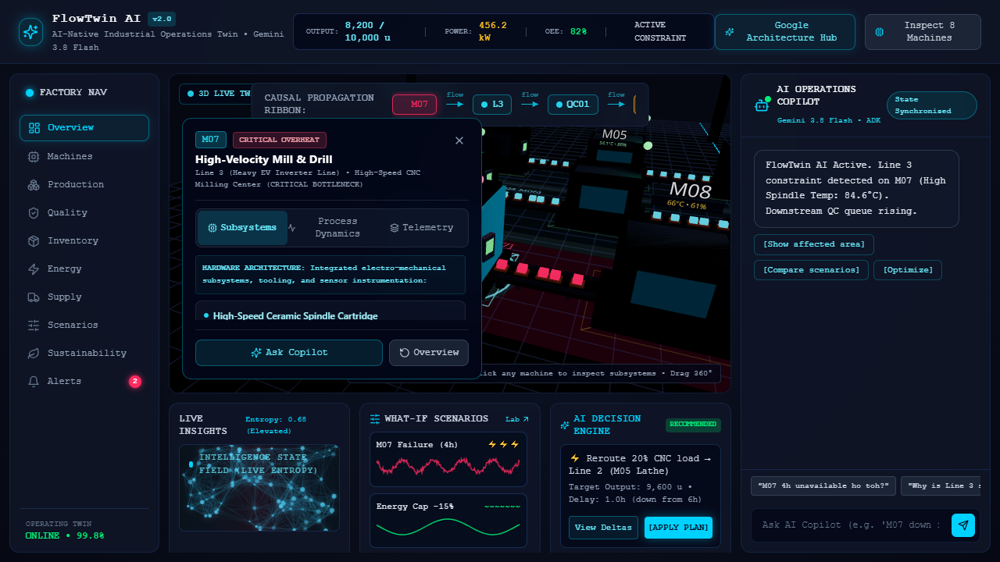

# FlowTwin AI — AI-Native Industrial Operations Twin

<div align="center">

[](https://nextjs.org/)
[](https://docs.pmnd.rs/react-three-fiber)
[](https://ai.google.dev/)
[](https://cloud.google.com/run)
[](https://python.org)
[](https://www.typescriptlang.org/)
[](LICENSE)

<br/>

**A real-time 3D Industrial Twin where autonomous AI agents continuously monitor factory telemetry, pinpoint causal bottlenecks, simulate what-if scenarios deterministically, and execute operational recovery plans.**

<br/>

[](docs/assets/dashboard_preview.png)

</div>

---

## 💡 Core Philosophy

```
┌─────────────────┐       ┌────────────────────────┐       ┌───────────────────────┐
│    AI THINKS    │  ──►  │    CODE CALCULATES     │  ──►  │  FRONTEND VISUALIZES  │
│ Gemini 3.8 / ADK│       │  Deterministic Physics │       │  Three.js / R3F Twin  │
└─────────────────┘       └────────────────────────┘       └───────────────────────┘
```

Modern manufacturing cannot tolerate generative AI hallucinations. When calculating throughput drops, shipment delays, or thermal runaway risks, **mathematical rigor must be absolute**.

**FlowTwin AI** strictly decouples reasoning from computation:
- **AI (Gemini 3.8 Flash & Google ADK)** orchestrates hypotheses, reads compact operational deltas, traverses physical dependency graphs, and drafts optimal decisions.
- **Code (Deterministic Simulation Engine)** calculates physics, queue dynamics, energy caps, and capacity equations with zero hallucination.
- **Frontend (Three.js & React Three Fiber)** renders a live 3D factory floor with active conveyors, glowing causal ribbons, camera focus beams, and particle entropy fields.

---

## 🌟 Key Highlights & Engineering Innovations

### 1. Interactive 3D Factory Floor
- **8 Dedicated Machine Stations (M01–M08)** across 3 parallel production lines:
  - **Line 1 (Continuous High-Speed Beverage)**: Depalletizer (`M01`), High-Speed Filler (`M02`), Tunnel Pasteurizer (`M03`).
  - **Line 2 (Precision Machining & Assembly)**: Raw Billet Saw (`M04`), 5-Axis CNC Lathe (`M05`), Ultrasonic Cleaning Bath (`M06`).
  - **Line 3 (Heavy EV Inverter & High-Torque Milling)**: High-Velocity Milling Center (`M07`), Vacuum Potting Unit (`M08`).
- **Conveyor Dynamics:** Real-time animated product flows with queue backpressure and bottleneck indicators.
- **Smart Camera Trajectory:** When an anomaly or scenario is selected, the camera automatically flies and aligns directly overhead the affected equipment.

### 2. Sensory Visualization (No Static 2D Dashboards)
- **Causal Propagation Ribbon:** Glowing spline trajectory tracing downstream failure ripple (`M07 ──► Line 3 ──► QC01 ──► Shipping`).
- **State Intelligence Field:** Dynamic particle network reflecting overall factory operational entropy and system stability in real time.
- **Focus Beam:** Target spotlight illuminating isolated equipment during deep-dive inspections.
- **Scenario Waveforms:** Fluid animated sine signatures representing baseline vs. scenario deviations.

### 3. Google ADK Multi-Agent Cluster
FlowTwin AI runs a 4-agent hierarchical architecture built on Google's Agent Development Kit (ADK):

| Agent | Model | Primary Role | Tools / Capabilities |
| :--- | :--- | :--- | :--- |
| **FlowTwin Orchestrator** | `Gemini 3.8 Flash` | Query intent classification & sub-agent routing | Event streaming, state coordination |
| **Observer Agent** | `Gemini 3.5 Flash-Lite` | Telemetry sentinel & anomaly change detection | `get_factory_telemetry` |
| **Causal Analyst Agent** | `Gemini 3.8 Flash` | Physical dependency graph traversal & root cause | Grounded SOP search, topological DAG tracing |
| **Simulator Agent** | `Gemini 3.8 Flash` | Zero-hallucination what-if scenario projection | `simulate_machine_failure`, `simulate_demand_change` |
| **Optimizer Agent** | `Gemini 3.8 Flash` | Pareto multi-objective operational solver | `simulate_energy_constraint`, `compare_scenarios` |

### 4. Deterministic Simulation Engine (Physics Decoupled from LLM)
Mathematical modeling of factory operations implemented in pure Python:
- **Machine Downtime Impact:** Calculates buffer depletion, starving down-lines, QC backlogs, and shipment delays.
- **Dynamic Energy Peak Shaving:** Reallocates load and shifts off-peak consumption without sacrificing production quotas.
- **Quality Drift Modeling:** Early-warning defect detection and rework cycle simulation.

### 5. Grounded RAG with Enterprise Factory SOPs
Grounds agent reasoning in industrial operating standards located in `knowledge/factory-docs`:
- `SOP_M07_Milling.md`: Thermal tolerances (85.0°C critical threshold, spindle ceramic bearings).
- `Energy_Management_Standard.md`: ISO 50001 compliance, peak-load shedding policies.
- `HACCP_Beverage_Sanitation_Standard.md`: Critical control points (CCP) for beverage lines.

---

## 🏗️ System Architecture

```
                                  OPERATOR / USER
                                         │
                                         ▼
                     ┌───────────────────────────────────────┐
                     │          GOOGLE CLOUD RUN             │
                     │  ┌─────────────────────────────────┐  │
                     │  │      Next.js 14 Frontend        │  │
                     │  │   • 3D Twin (Three.js / R3F)    │  │
                     │  │   • Particle Intelligence Field │  │
                     │  │   • AI Copilot & Scenario Lab   │  │
                     │  │   • Zustand Global Store        │  │
                     │  └────────────────┬────────────────┘  │
                     │                   │ SSE Event Stream  │
                     │  ┌────────────────▼────────────────┐  │
                     │  │    Streaming API Route Layer    │  │
                     │  └────────────────┬────────────────┘  │
                     └───────────────────┼───────────────────┘
                                         │
                                         ▼
                     ┌───────────────────────────────────────┐
                     │        GOOGLE AGENT RUNTIME           │
                     │  ┌─────────────────────────────────┐  │
                     │  │      Google ADK Framework       │  │
                     │  │   • Orchestrator Agent          │  │
                     │  │   • Observer Agent              │  │
                     │  │   • Causal Analyst Agent        │  │
                     │  │   • Simulator Agent             │  │
                     │  │   • Optimizer Agent             │  │
                     │  └────────┬────────────────┬───────┘  │
                     └───────────┼────────────────┼──────────┘
                                 │                │
                 ┌───────────────▼──────┐  ┌──────▼────────────────┐
                 │ Gemini 3.8 Flash &   │  │  Deterministic        │
                 │ Gemini 3.5 Flash-Lite│  │  Simulation Engine    │
                 └───────────────┬──────┘  └───────────────────────┘
                                 │
                                 ▼
                     ┌──────────────────────┐
                     │   Google Firestore   │
                     │   & Cloud Storage    │
                     └──────────────────────┘
```

---

## 📡 Custom Server-Sent Events (SSE) Protocol

The agent pipeline streams real-time state changes to the 3D twin using a high-efficiency compact event protocol:

| Event Type | Description | Sample Payload |
| :--- | :--- | :--- |
| `TOOL` | Agent tool execution notification | `{"event":"TOOL", "agent":"ObserverAgent", "step":"state"}` |
| `STATE` | Compact entity telemetry delta | `{"event":"STATE", "data":{"summary":"Line 3 constrained","oee":0.82}}` |
| `FOCUS` | 3D camera pan and zoom coordinates | `{"event":"FOCUS", "target":"M07", "zoom":1.45}` |
| `IMPACT` | Downstream constraint graph path | `{"event":"IMPACT", "source":"M07", "targets":["L3","QC01","SHIP01"]}` |
| `SCENARIO`| Deterministic scenario evaluation delta | `{"event":"SCENARIO", "data":{"output_delta":-541, "delay_hrs":3.2}}` |
| `RECOMMENDATION` | Action proposal with executable plan | `{"event":"RECOMMENDATION", "actions":["Apply Plan", "Export GCS"]}` |
| `DONE` | Event stream completion | `{"event":"DONE", "status":"completed"}` |

---

## 📂 Repository Structure

```
FlowTwin-AI/
├── apps/
│   └── web/                         # Next.js 14 Web Application
│       ├── app/                     # App Router (Live Twin, Scenarios, Sustainability)
│       │   ├── api/agent/stream/    # SSE streaming endpoint for AI Copilot
│       │   ├── globals.css          # Production styling & glassmorphism theme
│       │   ├── layout.tsx           # Shell layout & metadata
│       │   └── page.tsx             # Main Twin cockpit dashboard
│       ├── components/              # UI & 3D Visual System
│       │   ├── 3d/                  # Three.js / R3F Canvas, Machines, Conveyors, Beams
│       │   ├── copilot/             # AI Copilot chat & decision tiles
│       │   ├── dashboard/           # State field particles, scenario matrices
│       │   └── layout/              # Header, Factory navigation, KPI strips
│       └── lib/                     # Zustand state store, types, client utils
├── agents/                          # Google ADK Multi-Agent System
│   ├── adk_factory_agent.py         # Official Google ADK Agent declarations
│   ├── agent_runner.py              # CLI & microservice agent runner
│   ├── agent_search.py              # Grounded SOP search & knowledge retrieval
│   ├── agents_config.json           # Model & agent pipeline configurations
│   ├── evaluate_agents.py           # Verification & test suite
│   ├── causal/                      # Causal graph traversal logic
│   ├── observer/                    # Telemetry delta scanner
│   ├── optimizer/                   # Pareto constraint solver
│   ├── orchestrator/                # Master query routing
│   └── simulator/                   # Simulation bridge
├── simulation/                      # Deterministic Python Simulation Engine
│   ├── factory.py                   # Digital twin state & telemetry schema
│   ├── production.py                # Machine failure & demand simulation
│   ├── quality.py                   # Quality drift & defect rate modeling
│   ├── inventory.py                 # Buffer stocks & stockout calculation
│   └── energy.py                    # Energy peak shaving & scenario comparative analysis
├── cloud/                           # Cloud Run & Deployment
│   ├── agent-runtime/               # Agent Runtime microservice (FastAPI + SSE)
│   ├── cloud-run/                   # Cloud Run deploy scripts & service.yaml
│   ├── firestore_sync.py            # Firestore live telemetry synchronization
│   └── storage_manager.py           # Cloud Storage simulation artifact manager
├── data/                            # Machine specs, factory topology, baseline telemetry
├── knowledge/                       # Enterprise SOPs, ISO 50001, HACCP documentation
├── docs/                            # PRD, Architecture, Agents, Demo scripts & assets
├── Dockerfile                       # Multi-stage container for Google Cloud Run
└── requirements.txt                 # Python dependencies
```

---

## ⚡ Quickstart & Local Development

### Prerequisites
- **Node.js**: `v18.17.0+` (v20 LTS recommended)
- **Python**: `3.10+` (3.11 recommended)
- **Package Managers**: `npm` / `pnpm` and `pip`

---

### 1. Web Application & 3D Twin

```bash
# Navigate to web application directory
cd apps/web

# Install dependencies
npm install

# Start development server
npm run dev
```

Open [http://localhost:3000](http://localhost:3000) to view the 3D twin cockpit.

---

### 2. Python Simulation Engine & Agent Runtime

```bash
# Install Python dependencies from repository root
pip install -r requirements.txt

# Run deterministic simulation test
python -c "from simulation.production import simulate_machine_failure; print(simulate_machine_failure('M07', 4.0))"

# Start the Agent Runtime microservice
python cloud/agent-runtime/app.py
```

Microservice will start at `http://localhost:8001` with streaming SSE enabled on `/api/agent/stream`.

---

### 3. Agent Evaluation & Automated Testing

Run the automated agent verification suite to validate routing, deterministic tools, and SOP grounding:

```bash
python agents/evaluate_agents.py
```

Expected output:
```
============================================================
FlowTwin AI - Google Agents CLI Evaluation Suite
Platform: Google Gemini Enterprise Agent Platform / ADK
============================================================

[TC01] Testing Root Cause & Grounded RAG Retrieval...
  [PASS] Grounded RAG retrieval accurate from SOP_M07_Milling.md

[TC02] Testing Deterministic Simulation Tool (M07 failure 4h)...
  [PASS] Tool simulate_machine_failure returned exact delta: -541 units (Severity: critical)

[TC03] Testing Sustainability Optimization Tool (Energy Cap 15,900 kWh)...
  [PASS] Tool simulate_energy_constraint achieved: -2500.0 kWh with 0 production loss

============================================================
Evaluation Summary: 3/3 PASSED (100%) in 0.003s
All agents and deterministic tools verified compliant with Google ADK spec.
============================================================
```

---

## 🐳 Docker & Google Cloud Run Deployment

FlowTwin AI is packaged with a multi-stage production container that serves the optimized Next.js frontend and exposes the agent microservice on Google Cloud Run:

```bash
# Build production container
docker build -t flowtwin-ai:latest .

# Run locally on port 8080
docker run -p 8080:8080 flowtwin-ai:latest
```

### One-Click Cloud Run Deployment

```bash
# Deploy using PowerShell script
.\cloud\cloud-run\deploy.ps1

# Or deploy via gcloud CLI
gcloud run deploy flowtwin-ai \
  --source . \
  --platform managed \
  --region us-central1 \
  --allow-unauthenticated
```

---

## 🧪 What-If Scenarios Supported

1. **Machine M07 Thermal Runaway & Failure (4h):**
   - Simulates spindle overheat (84.6°C), queue backup across Line 3, and QC backlog accumulation.
2. **Factory-Wide Demand Surge (+20%):**
   - Projects bottleneck machines, overtime requirements, and raw material buffer depletion.
3. **Dynamic Energy Cap (-15% Peak Shaving):**
   - Identifies non-critical auxiliary loads to throttle during peak tariff windows with 0% throughput reduction.
4. **Raw Material Delivery Delay (3 Days):**
   - Evaluates buffer stock safety margins and schedules dynamic line rerouting.

---

## 📜 License

This project is licensed under the [MIT License](LICENSE).
